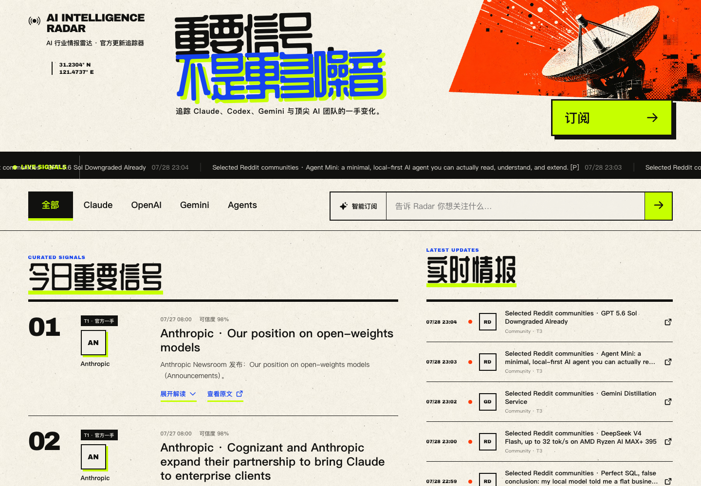
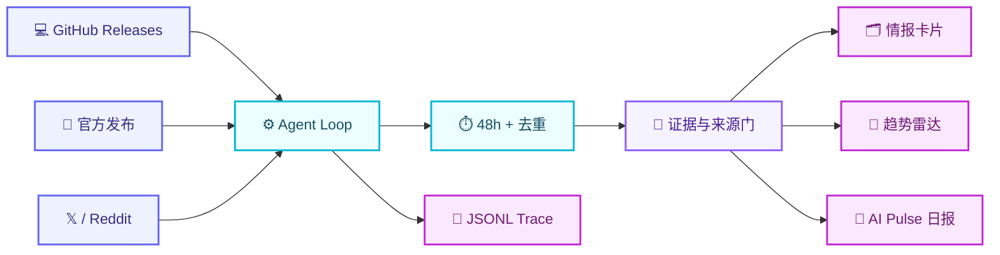

<p align="center">
  <strong>简体中文</strong> · <a href="README_EN.md">English</a>
</p>

<p align="center">
  
</p>

<h1 align="center">🛰️ AI Intelligence Radar</h1>

<p align="center">
  <strong>把一手 AI 动态变成可追溯的判断，再沉淀为自己的长期知识库。</strong>
</p>

<p align="center">
  <a href="https://github.com/jj1292/ai-intelligence-radar/actions/workflows/test.yml"></a>
  
  
  
</p>

<p align="center">
  
  
  
  
  
  
</p>

<p align="center">
  <a href="#-为什么做这个项目">为什么</a> ·
  <a href="#-直接订阅">订阅</a> ·
  <a href="#-系统如何工作">工作流</a> ·
  <a href="#-30-秒体验">快速开始</a> ·
  <a href="#-输出目录">输出</a> ·
  <a href="#%EF%B8%8F-roadmap">Roadmap</a>
</p>

<p align="center">
  <a href="https://jj1292.github.io/AI-Intelligence-Radar/">
    
  </a>
</p>

<p align="center">
  <a href="https://jj1292.github.io/AI-Intelligence-Radar/"><strong>🌐 浏览公开网站</strong></a>
</p>

---

## ✨ 为什么做这个项目

每天的信息很多，但真正能改变认知的信号很少。这个项目不追求“抓得最多”，而是建立一条从信息到判断的可靠链路。

| 🛰️ 一手信号 | 🧠 认知卡片 | 📈 趋势雷达 |
| --- | --- | --- |
| 跟踪官方发布、官方仓库、X 一手账号和 Reddit 社区 | 阅读正文后完成核心提炼、关键要点、分析与行动输出 | 只有多个独立信号连续出现，才升级为趋势候选 |

> [!TIP]
> **目标不是替你读完互联网，而是每天留下少量、可复核、以后还能用的知识。**

> [!NOTE]
> **v0.7 把订阅源变成一份可直接编辑的清单：维护者在 GitHub 网页增删来源，Agent 自动重新发布；普通订阅者只读公开 RSS/JSON。**

## 🌈 当前能力

<table>
  <tr>
    <td width="50%" valign="top">
      <h3>🔭 Source Radar</h3>
      <p>统一管理 Codex、Claude、Gemini、X、Reddit 等来源，并记录采集方式与授权状态。</p>
    </td>
    <td width="50%" valign="top">
      <h3>🧭 Source Tiers</h3>
      <p>T1 官方事实、T2 一手账号、T3 社区信号分级，防止把热度误写成结论。</p>
    </td>
  </tr>
  <tr>
    <td width="50%" valign="top">
      <h3>🗂️ Knowledge Cards</h3>
      <p>输出可移植 Markdown，保留时间、公司、主题、短证据和影响判断，可选用 Obsidian 阅读。</p>
    </td>
    <td width="50%" valign="top">
      <h3>📡 Trend Detection</h3>
      <p>至少两条独立信号才进入趋势候选，并持续观察跨公司、跨来源的变化。</p>
    </td>
  </tr>
  <tr>
    <td width="50%" valign="top">
      <h3>⚙️ Observable Loop</h3>
      <p>RunState 驱动采集、过滤、报告、日报和停止；每次规划与工具调用均写入 JSONL Trace。</p>
    </td>
    <td width="50%" valign="top">
      <h3>⏱️ 48h Freshness Gate</h3>
      <p>默认排除 48 小时以外及未来时间信号，并将同一来源连续发布与独立趋势证据区分开。</p>
    </td>
  </tr>
</table>

## 🧩 来源矩阵

| 等级 | 来源 | 角色 | 当前状态 |
| :---: | --- | --- | :---: |
| 🟣 **T1** | 官方 Release Notes、Newsroom、官方 GitHub | 事实底座 |  |
| 🔵 **T2** | 官方与核心团队 X 账号 | 一手补充、扩散信号 |  |
| 🟠 **T3** | Reddit AI 社区 | 问题、用例、情绪和弱信号 |  |

默认清单包含 **Anthropic 官方 Newsroom、3 个 GitHub Release 仓库、3 个 Reddit 社区和 5 个 X 一手账号**。官方博客、GitHub 与 Reddit 无需认证即可运行；X 只在维护者配置后台账号后启用。日常只需修改 [`config/subscriptions.json`](config/subscriptions.json)，高级来源注册表保留在 [`config/sources.json`](config/sources.json)。

## 🔄 系统如何工作



**AI Pulse 是 Radar Agent 生成的日报格式，不是第二个项目。** Dify 可用于可视化编排和框架对照，详见 [`Dify 可选适配器`](docs/adapters/dify.md)。

## 🔔 直接订阅

普通订阅者无需 X 账号，也不用安装或运行本项目。把下面任一地址添加到 Feedly、Inoreader、FreshRSS、NetNewsWire 或其他阅读器即可：

- **公开网站**：[`https://jj1292.github.io/AI-Intelligence-Radar/`](https://jj1292.github.io/AI-Intelligence-Radar/)
- **RSS 2.0**：[`https://jj1292.github.io/AI-Intelligence-Radar/feed.xml`](https://jj1292.github.io/AI-Intelligence-Radar/feed.xml)
- **JSON Feed 1.1**：[`https://jj1292.github.io/AI-Intelligence-Radar/feed.json`](https://jj1292.github.io/AI-Intelligence-Radar/feed.json)

```text
维护者账号（一次授权） → 定时 Agent → RSS / JSON → 所有订阅者
```

订阅端只读取公开信号，不接触维护者账号或 Cookie。部署方式与安全边界见 [`公开订阅发布器`](docs/deployment/subscription-publisher.md)。

## ✏️ 修改自己的订阅源

无需改 Python。打开 [`config/subscriptions.json`](config/subscriptions.json)，点击右上角铅笔，修改后提交即可。订阅清单变化会自动触发一次发布：

| 想订阅什么 | 修改位置 | 示例 |
| --- | --- | --- |
| Claude / Anthropic 官方博客 | `official_web` | `"url": "https://www.anthropic.com/news"` |
| 没有 RSS 的博客 / 新闻站 | `official_web` | `"adapter": "firecrawl"` |
| GitHub Release | `github_releases` | `"repo": "openai/codex"` |
| 任意 RSS / Atom | `rss_feeds` | `"url": "https://example.com/feed.xml"` |
| Reddit 社区 | `reddit.communities` | `"LocalLLaMA"` |
| X 账号 | `x.accounts` | `"username": "OpenAI"` |

把某项的 `"enabled"` 改为 `false` 即可暂停，不必删除。配置文件只能放公开来源；Cookie、Token、API Key 仍然只能放 GitHub Secrets。完整示例与常见错误见 [`订阅源修改指南`](docs/customize-subscriptions.md)。

## ⚡ 30 秒体验

### 1. 安装依赖

```bash
python3 -m pip install -r requirements.txt
```

### 2. 运行真实 Radar Agent

```bash
python3 -m agent.runner \
  --config config/subscriptions.json \
  --output outputs/latest-radar \
  --hours 48
```

默认会读取 OpenAI Codex、Anthropic Claude Code、Gemini CLI Release 和合并后的 Reddit 公共 RSS，输出知识卡片、趋势雷达、AI Pulse 日报和完整工具 Trace。未配置后台账号时会自动跳过 X。

### 3. 运行测试与严格评测

```bash
python3 -m unittest discover -s tests -v
python3 evaluate_radar.py --strict
```


当前基线：**3 个案例全部通过，平均分 2.0/2**。v0.7 真实链路在无 X 凭证条件下读取 55 条 GitHub/Reddit 内容，筛选 46 条写入 Feed，0 个工具错误。

## 🧪 评估先行

AI 产品不能只看一次输出是否“像样”。本项目从六个维度持续评估同一组真实任务：

| 维度 | 核心问题 |
| --- | --- |
| 🎯 相关性 | 应该出现的趋势是否出现，噪声是否被挡住？ |
| 🔗 来源完整性 | 是否保留时间、来源名称和原始链接？ |
| 🧭 覆盖度 | 任务要求的关键信号是否完整？ |
| ⏱️ 去重与时效 | 重复和过期信息是否被排除？ |
| 💡 判断价值 | 是否真正完成提炼、分析和可执行输出？ |
| ⚙️ 过程可靠性 | 卡片、趋势报告与运行状态是否一致？ |

每项使用 `0 / 1 / 2` 三档评分，并设置来源混淆、链接缺失、编造证据、凭证泄露和越权操作等一票否决项。完整规则见 [`evals/rubric.md`](evals/rubric.md)。

## 💜 输出目录

```text
ai-intelligence-radar/
├── signals/
│   └── 2026-07-22/
│       ├── openai-xxxxxxxxxx.md
│       ├── anthropic-xxxxxxxxxx.md
│       └── community-xxxxxxxxxx.md
├── trends/
│   └── 2026-07-22-trend-radar.md
├── briefings/
│   └── 2026-07-22-ai-pulse.md
└── agent-trace-xxxxxxxx.jsonl
```

Markdown 是默认可移植格式，可以放在任意目录；Obsidian 只是可选阅读端，不是项目代码存放位置。

每张卡片固定包含：

- 🔗 原始来源与发布时间
- 🏢 公司、平台和来源等级
- 🧠 核心主张提炼
- 📌 2–5 个关键事实、机制或约束
- 🔬 对技术、产品与商业影响的分析
- 🎯 可用于更新认知或采取行动的输出

规范定义见 [`schemas/intelligence-signal.schema.json`](schemas/intelligence-signal.schema.json)。

## 🔐 平台与数据边界

> [!IMPORTANT]
> - 普通订阅者不需要提供任何凭证；只有托管发布器的维护者需要配置采集账号。
> - 当前后台 X 适配器基于非官方 `twscrape`，免费但可能因接口变化失效，也有账号风控风险；发布器应使用专用账号。
> - Cookie 只进入本机数据库或 GitHub Actions Secret；生产环境优先使用 X 官方 API。
> - Reddit 当前读取公开 RSS，只保存链接、必要元数据和短摘要；如未来改用 Data API，再单独接入 OAuth。
> - API Key、Token 和 OAuth 凭证只能进入本地环境变量或 GitHub Secret。
> - 知识库保存链接、必要元数据、短证据和衍生判断，不批量复制完整平台内容。
> - T3 社区热度必须经过 T1 官方来源或复现实验交叉验证。

## 🗺️ Roadmap

| 版本 | 主题 | 状态 |
| :---: | --- | :---: |
| `v0.1` | AI Pulse 简报原型、输入契约、测试与 CI | ✅ Done |
| `v0.2` | 来源注册表、情报 Schema、Markdown 卡片、趋势雷达 | ✅ Done |
| `v0.3` | Eval Contract、3 个基线案例、评分器与可复现报告 | ✅ Done |
| `v0.4` | GitHub Atom、48 小时时效、RunState、最小 Loop、AI Pulse 输出、Trace | ✅ Done |
| `v0.5` | X 后台采集、来源分发、成功后增量 Checkpoint、账号安全边界 | ✅ Done |
| `v0.6` | 公开 RSS/JSON、定时发布器、一次认证/多人订阅 | ✅ Done |
| `v0.7` | 可编辑订阅清单、动态发布、通用 RSS/Atom、Reddit 公共源 | ✅ Done |
| `v0.8` | 公开浏览网站、持续重要信号、Firecrawl 通用网页适配器 | ✅ Done |
| `v0.9` | GitHub Models 正文分析、Insight Contract、提炼—分析—输出 | 🚧 Current |
| `v1.0` | 记忆、回放评测、周/月复盘、主题订阅与来源质量评分 | 🌟 Vision |

## 📚 文档

- 🗺️ [`项目总览`](PROJECT.md)
- 📘 [`v0.2 PRD`](docs/PRD-AI-Intelligence-Radar-v0.2.md)
- 🧠 [`Agent Harness 架构构思`](docs/agent-harness-architecture.md)
- 🎯 [`AI 产品评估与 Agent 评测指南`](docs/ai-product-evaluation-guide.md)
- 🧠 [`正文分析流水线`](docs/analysis-pipeline.md)
- 🔌 [`Dify 可选适配器`](docs/adapters/dify.md)
- 🔥 [`Firecrawl 可选网页适配器`](docs/adapters/firecrawl.md)
- 🔔 [`公开订阅发布器`](docs/deployment/subscription-publisher.md)
- ✏️ [`订阅源修改指南`](docs/customize-subscriptions.md)
- 𝕏 [`X 后台采集适配器`](docs/adapters/x-twscrape.md)
- 🧭 [`从 AI Pulse 到 Radar`](docs/history/from-ai-pulse-to-radar.md)
- 🧩 [`情报信号 Schema`](schemas/intelligence-signal.schema.json)
- 📡 [`我的订阅清单`](config/subscriptions.json)
- 🧰 [`高级来源注册表`](config/sources.json)
- 🧪 [`评测规则`](evals/rubric.md)
- 📊 [`v0.3 基线报告`](evals/baseline-report.md)
- 🧾 [`v0.4 真实运行 Trace`](examples/output/v0.4-live-final/agent-trace-v0.4-unified.jsonl)
- 📝 [`Changelog`](CHANGELOG.md)

---

<p align="center">
  <strong>如果这个项目也能帮你减少信息焦虑、建立自己的 AI 判断，欢迎点一个 ⭐ Star。</strong>
</p>

<p align="center">
  Built with <strong>Python</strong> · <strong>Agent Loop</strong> · <strong>JSONL</strong> · <strong>Markdown</strong>
</p>

<p align="center">
  <a href="LICENSE"></a>
</p>
