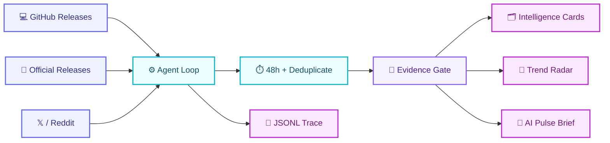

<p align="center">
  <a href="README.md">简体中文</a> · <strong>English</strong>
</p>

<p align="center">
  
</p>

<h1 align="center">🛰️ AI Intelligence Radar</h1>

<p align="center">
  <strong>Turn first-hand AI updates into traceable insights and a knowledge base that compounds over time.</strong>
</p>

<p align="center">
  <a href="https://github.com/jj1292/ai-intelligence-radar/actions/workflows/test.yml"></a>
  
  
  
</p>

<p align="center">
  
  
  
  
  
  
</p>

<p align="center">
  <a href="#-why-this-project">Why</a> ·
  <a href="#-subscribe-directly">Subscribe</a> ·
  <a href="#-how-it-works">Workflow</a> ·
  <a href="#-30-second-quick-start">Quick Start</a> ·
  <a href="#-output-directory">Outputs</a> ·
  <a href="#%EF%B8%8F-roadmap">Roadmap</a>
</p>

---

## ✨ Why This Project

There is no shortage of daily information, but only a small number of signals can genuinely improve how we understand the AI industry. This project is not about collecting the most content. It builds a reliable path from information to judgment.

| 🛰️ First-hand Signals | 🧠 Insight Cards | 📈 Trend Radar |
| --- | --- | --- |
| Track official announcements, repositories, first-hand X accounts, and Reddit communities | Every item answers what happened, why it matters, and what evidence supports it | A signal becomes a trend candidate only after it appears repeatedly across independent sources |

> [!TIP]
> **The goal is not to read the entire internet for you. It is to preserve a small set of verifiable insights that remain useful over time.**

> [!NOTE]
> **v0.7 turns sources into one editable subscription list: maintainers add or remove sources on GitHub, the Agent republishes automatically, and subscribers only read public RSS/JSON feeds.**

## 🌈 Current Capabilities

<table>
  <tr>
    <td width="50%" valign="top">
      <h3>🔭 Source Radar</h3>
      <p>Manage Codex, Claude, Gemini, X, Reddit, and other sources in one registry, including collection methods and authorization status.</p>
    </td>
    <td width="50%" valign="top">
      <h3>🧭 Source Tiers</h3>
      <p>Separate T1 official facts, T2 first-hand accounts, and T3 community signals so popularity is not mistaken for evidence.</p>
    </td>
  </tr>
  <tr>
    <td width="50%" valign="top">
      <h3>🗂️ Knowledge Cards</h3>
      <p>Generate portable Markdown with timestamps, companies, topics, short evidence, and impact assessments; Obsidian remains optional.</p>
    </td>
    <td width="50%" valign="top">
      <h3>📡 Trend Detection</h3>
      <p>Require at least two independent signals before creating a trend candidate, then track changes across companies and sources.</p>
    </td>
  </tr>
  <tr>
    <td width="50%" valign="top">
      <h3>⚙️ Observable Loop</h3>
      <p>RunState controls collection, filtering, reports, daily briefs, and stopping; every decision and tool call is recorded in JSONL.</p>
    </td>
    <td width="50%" valign="top">
      <h3>⏱️ 48h Freshness Gate</h3>
      <p>Exclude stale and future-dated signals while separating repeated releases from independent trend evidence.</p>
    </td>
  </tr>
</table>

## 🧩 Source Matrix

| Tier | Sources | Role | Status |
| :---: | --- | --- | :---: |
| 🟣 **T1** | Official release notes, newsrooms, and GitHub repositories | Factual foundation |  |
| 🔵 **T2** | Official and core-team X accounts | First-hand context and distribution signals |  |
| 🟠 **T3** | Reddit AI communities | Problems, use cases, sentiment, and weak signals |  |

The default list contains the **official Anthropic Newsroom, 3 GitHub Release repositories, 3 Reddit communities, and 5 first-hand X accounts**. The official blog, GitHub, and Reddit run without authentication; X is enabled only after the maintainer configures a backend account. Day-to-day changes belong in [`config/subscriptions.json`](config/subscriptions.json); the advanced registry remains in [`config/sources.json`](config/sources.json).

## 🔄 How It Works



**AI Pulse is a daily output generated by Radar Agent, not a second product.** Dify remains available for visual orchestration and framework comparison; see the [`optional Dify adapter`](docs/adapters/dify.md).

## 🔔 Subscribe Directly

Subscribers need no X account and do not need to install or run this project. Add either URL to Feedly, Inoreader, FreshRSS, NetNewsWire, or another feed reader:

- **Public website**: [`https://jj1292.github.io/AI-Intelligence-Radar/`](https://jj1292.github.io/AI-Intelligence-Radar/)
- **RSS 2.0**: [`https://jj1292.github.io/AI-Intelligence-Radar/feed.xml`](https://jj1292.github.io/AI-Intelligence-Radar/feed.xml)
- **JSON Feed 1.1**: [`https://jj1292.github.io/AI-Intelligence-Radar/feed.json`](https://jj1292.github.io/AI-Intelligence-Radar/feed.json)

```text
Maintainer account (one-time auth) → scheduled Agent → RSS / JSON → every subscriber
```

Subscribers only read public signals and never touch the publisher account or cookies. See [`public feed publisher`](docs/deployment/subscription-publisher.md) for deployment and security boundaries.

## ✏️ Customize Your Sources

No Python changes are required. Open [`config/subscriptions.json`](config/subscriptions.json), click the pencil icon, edit the list, and commit. A subscription-list change automatically triggers a new publication:

| What to follow | Section | Example |
| --- | --- | --- |
| Official Claude / Anthropic blog | `official_web` | `"url": "https://www.anthropic.com/news"` |
| Blog/news site without RSS | `official_web` | `"adapter": "firecrawl"` |
| GitHub Releases | `github_releases` | `"repo": "openai/codex"` |
| Any RSS / Atom feed | `rss_feeds` | `"url": "https://example.com/feed.xml"` |
| Reddit communities | `reddit.communities` | `"LocalLLaMA"` |
| X accounts | `x.accounts` | `"username": "OpenAI"` |

Set `"enabled"` to `false` to pause an entry without deleting it. The file must only contain public source settings; cookies, tokens, and API keys still belong in GitHub Secrets. See the [`source customization guide`](docs/customize-subscriptions.md) for complete examples and validation errors.

## ⚡ 30-Second Quick Start

### 1. Install dependencies

```bash
python3 -m pip install -r requirements.txt
```

### 2. Run the live Radar Agent

```bash
python3 -m agent.runner \
  --config config/subscriptions.json \
  --output outputs/latest-radar \
  --hours 48
```

By default, the run reads OpenAI Codex, Anthropic Claude Code, Gemini CLI Releases, and a combined public Reddit feed. It writes cards, a trend radar, an AI Pulse daily brief, and a complete tool trace. X is skipped automatically when no backend account is configured.

### 3. Run tests and the strict evaluation gate

```bash
python3 -m unittest discover -s tests -v
python3 evaluate_radar.py --strict
```


Current baseline: **all 3 cases pass with an average score of 2.0/2**. The v0.7 live path, without X credentials, read 55 GitHub/Reddit items, selected 46 for the feed, and completed with zero tool errors.

## 🧪 Evaluation First

An AI product cannot be judged by whether one output merely looks plausible. This project repeatedly evaluates the same real tasks across six dimensions:

| Dimension | Core question |
| --- | --- |
| 🎯 Relevance | Are expected trends surfaced while noise is blocked? |
| 🔗 Evidence | Are time, short evidence, and original sources preserved? |
| 🧭 Coverage | Are the task's required signals complete? |
| ⏱️ Deduplication & freshness | Are duplicates and stale items excluded? |
| 💡 Judgment value | Does the output explain why it matters and state its limits? |
| ⚙️ Process reliability | Do cards, trend reports, and run state agree? |

Each dimension uses a `0 / 1 / 2` scale. Source-tier confusion, missing source links, fabricated evidence, credential leaks, and unauthorized external actions are veto conditions. See [`evals/rubric.md`](evals/rubric.md) for the complete contract.

## 💜 Output Directory

```text
ai-intelligence-radar/
├── signals/
│   └── 2026-07-22/
│       ├── openai-xxxxxxxxxx.md
│       ├── anthropic-xxxxxxxxxx.md
│       └── community-xxxxxxxxxx.md
├── trends/
│   └── 2026-07-22-trend-radar.md
├── briefings/
│   └── 2026-07-22-ai-pulse.md
└── agent-trace-xxxxxxxx.jsonl
```

Markdown is the portable default and can be written anywhere. Obsidian is an optional reader, not the location of the project source.

Each card consistently includes:

- 🔗 Original source and publication time
- 🏢 Company, platform, and source tier
- 📝 One-sentence conclusion
- 💡 Why it matters
- 🔎 Short evidence that can be verified against the original source
- 🎯 Impact score, confidence level, and judgment boundaries

The specification is defined in [`schemas/intelligence-signal.schema.json`](schemas/intelligence-signal.schema.json).

## 🔐 Platform and Data Boundaries

> [!IMPORTANT]
> - Subscribers provide no credentials; only the maintainer operating the hosted publisher configures a collection account.
> - The backend X adapter uses the unofficial `twscrape` project. It is free but may break when X changes its internals and may expose the account to platform risk; use a dedicated publisher account.
> - Cookies stay in a local database or GitHub Actions Secrets. Prefer the official X API in production.
> - Reddit currently uses public RSS and stores only links, necessary metadata, and short summaries. OAuth will be added separately if the project moves to the Data API.
> - API keys, tokens, and OAuth credentials must stay in local environment variables or GitHub Secrets.
> - The knowledge base stores links, necessary metadata, short evidence, and derived analysis rather than bulk copies of full platform content.
> - T3 community interest must be cross-checked against a T1 official source or a reproducible experiment.

## 🗺️ Roadmap

| Version | Theme | Status |
| :---: | --- | :---: |
| `v0.1` | AI Pulse briefing prototype, input contract, tests, and CI | ✅ Done |
| `v0.2` | Source registry, intelligence schema, Markdown cards, and trend radar | ✅ Done |
| `v0.3` | Eval Contract, 3 baseline cases, scorer, and reproducible report | ✅ Done |
| `v0.4` | GitHub Atom, 48-hour gate, RunState, minimal Loop, AI Pulse output, and Trace | ✅ Done |
| `v0.5` | Backend X collection, source dispatch, post-success checkpoint, and account boundaries | ✅ Done |
| `v0.6` | Public RSS/JSON feeds, scheduled publisher, one authentication for all subscribers | ✅ Done |
| `v0.7` | Editable subscription list, dynamic publishing, generic RSS/Atom, public Reddit feed | 🚧 Current |
| `v0.8` | Model planner, general resume, and official web adapters | 🧭 Next |
| `v1.0` | Memory, replay evaluation, periodic reviews, subscriptions, and source-quality scoring | 🌟 Vision |

## 📚 Documentation

- 🗺️ [`Project overview`](PROJECT.md)
- 📘 [`v0.2 PRD`](docs/PRD-AI-Intelligence-Radar-v0.2.md)
- 🧠 [`Agent Harness architecture`](docs/agent-harness-architecture.md)
- 🎯 [`AI product and agent evaluation guide`](docs/ai-product-evaluation-guide.md)
- 🔌 [`Optional Dify adapter`](docs/adapters/dify.md)
- 🔔 [`Public feed publisher`](docs/deployment/subscription-publisher.md)
- ✏️ [`Source customization guide`](docs/customize-subscriptions.md)
- 𝕏 [`Backend X adapter`](docs/adapters/x-twscrape.md)
- 🧭 [`From AI Pulse to Radar`](docs/history/from-ai-pulse-to-radar.md)
- 🧩 [`Intelligence signal schema`](schemas/intelligence-signal.schema.json)
- 📡 [`My subscription list`](config/subscriptions.json)
- 🧰 [`Advanced source registry`](config/sources.json)
- 🧪 [`Evaluation rubric`](evals/rubric.md)
- 📊 [`v0.3 baseline report`](evals/baseline-report.md)
- 🧾 [`v0.4 live Agent trace`](examples/output/v0.4-live-final/agent-trace-v0.4-unified.jsonl)
- 📝 [`Changelog`](CHANGELOG.md)

---

<p align="center">
  <strong>If this project helps you reduce information overload and develop your own perspective on AI, consider giving it a ⭐ Star.</strong>
</p>

<p align="center">
  Built with <strong>Python</strong> · <strong>Agent Loop</strong> · <strong>JSONL</strong> · <strong>Markdown</strong>
</p>

<p align="center">
  <a href="LICENSE"></a>
</p>
